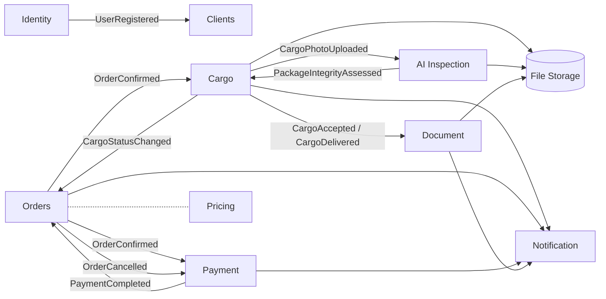

# CargoService — платформа грузоперевозок

Учебно-пет-проект: микросервисная система, описывающая полный жизненный цикл груза — **заявка → расчёт стоимости → приёмка → перевозка → выдача → оплата и документы**.

Монорепозиторий на **.NET 10 / C#**: 10 микросервисов, у каждого своя БД PostgreSQL, обмен событиями через RabbitMQ по паттерну transactional outbox, аутентификация через Keycloak, централизованное логирование Serilog → Seq. Весь стек поднимается одной командой `docker compose up`.

Подробная архитектурная спецификация и бэклог по фазам — в [spec.md](spec.md). Конвенции разработки — в [CLAUDE.md](CLAUDE.md).

## Возможности

- **Заявки**: создание заявки клиентом с синхронным расчётом стоимости, подтверждение, отмена.
- **Тарифы**: справочник тарифных ставок (тип отправки, упаковка, забор/доставка, страхование) и калькулятор итоговой цены.
- **Приёмка и трекинг**: акт приёмки с фиксацией состояния груза и фото, история статусов, публичный трекинг по номеру.
- **ИИ-оценка упаковки**: автоматическая проверка целостности упаковки по фотографиям, дополняющая оценку сотрудника.
- **Уведомления**: email-уведомления клиенту по шаблонам на ключевых этапах жизненного цикла.
- **Документы**: генерация транспортной накладной и актов в PDF.
- **Оплата**: выставление счёта после подтверждения заявки, обработка webhook провайдера, возврат средств при отмене.
- **Файлы**: единое хранилище фото и сканов поверх S3-совместимого MinIO с выдачей presigned URL.

## Архитектура

Сервисы не ходят в чужие базы и общаются только через события RabbitMQ (topic exchange `cargoservice.events`); синхронный HTTP-вызов используется точечно — например, расчёт цены при создании заявки.



Каждый сервис построен по Clean Architecture — один проект на слой:

```
{ServiceName}.Domain/          сущности, без внешних зависимостей
{ServiceName}.Application/     сценарии использования + интерфейсы портов
{ServiceName}.Persistence/     EF Core, конфигурации сущностей, репозитории, миграции
{ServiceName}.Infrastructure/  RabbitMQ, внешние интеграции, фоновые джобы
{ServiceName}/                 ASP.NET Core Web API
```

Надёжность доставки событий обеспечивает **transactional outbox**: доменная сущность и исходящее событие пишутся в одной транзакции БД, а фоновый `BackgroundService` публикует накопленные строки в RabbitMQ и переживает недоступность брокера.

## Стек

| Область | Технологии |
|---|---|
| Платформа | .NET 10, ASP.NET Core, C# |
| Хранение | PostgreSQL, EF Core (database per service), MinIO (S3) |
| Обмен сообщениями | RabbitMQ (topic exchange, transactional outbox) |
| Аутентификация | Keycloak (OpenID Connect, JWT, realm as code) |
| Логирование | Serilog → Seq |
| API-слой | FluentValidation, Mapster, OpenAPI + Scalar |
| Тесты | xUnit, Moq, Testcontainers, `WebApplicationFactory` |
| Инфраструктура | Docker, Docker Compose, Mailpit |

## Сервисы

| Сервис | Порт | Назначение |
|---|---|---|
| [identity-service](services/identity-service) | 8081 | Пользователи и роли, провижининг в Keycloak, прокси login/refresh |
| [clients-service](services/clients-service) | 8082 | Контрагенты (отправители/получатели) и аккаунты клиентов |
| [pricing-service](services/pricing-service) | 8083 | Тарифные ставки и расчёт стоимости заявки |
| [orders-service](services/orders-service) | 8084 | Заявки клиента: создание, подтверждение, отмена |
| [cargo-service](services/cargo-service) | 8085 | Приёмка груза, история статусов, публичный трекинг |
| [file-storage-service](services/file-storage-service) | 8086 | Хранение файлов поверх MinIO, presigned URL |
| [notification-service](services/notification-service) | 8087 | Шаблоны и отправка уведомлений, журнал отправок |
| [ai-inspection-service](services/ai-inspection-service) | 8088 | Оценка целостности упаковки по фото |
| [document-service](services/document-service) | 8089 | Генерация накладных и актов в PDF |
| [payment-service](services/payment-service) | 8090 | Счета, webhook провайдера оплаты, возвраты |

Роли системы: `Client`, `Manager`, `WarehouseOperator`, `Courier`, `Admin`.

## События

Общие DTO событий вынесены в [`shared/CargoService.Contracts`](shared/CargoService.Contracts) (версионированные контракты `Events/V1`), там же — конвенции именования exchange и routing key.

| Событие | Издатель | Подписчики |
|---|---|---|
| `UserRegistered` | Identity | Clients |
| `OrderCreated` / `OrderConfirmed` / `OrderCancelled` | Orders | Cargo, Payment, Notification |
| `TariffChanged` | Pricing | Orders |
| `CargoAccepted` / `CargoStatusChanged` / `CargoDelivered` | Cargo | Orders, Notification, Document |
| `CargoPhotoUploaded` | Cargo | AI Inspection |
| `PackageIntegrityAssessed` | AI Inspection | Cargo, Notification |
| `PaymentCompleted` / `PaymentFailed` / `RefundIssued` | Payment | Orders, Notification |
| `DocumentGenerated` | Document | Notification, Orders |

## Быстрый старт

Нужен только Docker.

```bash
docker compose up --build
```

Поднимутся все сервисы и инфраструктура; миграции БД применяются автоматически при старте каждого API. `docker-compose.override.yml` подхватывается автоматически и запускает сервисы в dev-режиме (`dotnet watch`, исходники смонтированы в контейнер) — правки в `.cs` подхватываются без пересборки образа.

Что где открывается:

| Интерфейс | Адрес | Доступ |
|---|---|---|
| API-документация сервиса (Scalar) | `http://localhost:{порт}/scalar` | см. таблицу портов выше |
| Keycloak | http://localhost:8080 | `admin` / `admin` |
| RabbitMQ Management | http://localhost:15672 | `rabbitmq` / `rabbitmq` |
| MinIO Console | http://localhost:9001 | `minioadmin` / `minioadmin123` |
| Seq (логи) | http://localhost:5341 | без пароля |
| Mailpit (почта) | http://localhost:8025 | без пароля |

Получить токен для защищённых эндпоинтов можно засеянным пользователем `admin@cargoservice.local` / `admin`:

```bash
curl -X POST http://localhost:8081/api/auth/login -H "Content-Type: application/json" -d "{\"email\":\"admin@cargoservice.local\",\"password\":\"admin\"}"
```

> Все пароли и секреты в репозитории — заглушки для локального окружения, не для production.

## Разработка

Сборка и запуск отдельного сервиса (из его папки, например `services/identity-service/`):

```bash
dotnet build IdentityService.slnx
dotnet run --project IdentityService
```

Миграции EF Core (из проекта `{ServiceName}.Persistence`):

```bash
dotnet ef migrations add <Name>
```

`--startup-project` не нужен: в каждом сервисе есть `IDesignTimeDbContextFactory`, поэтому `dotnet ef` строит `DbContext` напрямую, без запуска хоста.

Тесты — по два проекта у каждого сервиса, кроме `file-storage-service`: unit-тесты слоя Application (xUnit + Moq, без внешних зависимостей) и интеграционные тесты API поверх одноразового контейнера PostgreSQL (Testcontainers, нужен запущенный Docker):

```bash
dotnet test services/identity-service/IdentityService.Application.Tests
dotnet test services/identity-service/IdentityService.IntegrationTests
```

## Статус

Реализованы фазы 0–9 и 11 из бэклога [spec.md](spec.md): инфраструктура монорепозитория и все десять сервисов выше, с unit- и интеграционными тестами.

В планах:

- **Logistics Service** — склады, транспорт, маршруты, назначение курьеров.
- **API Gateway** — единая точка входа, маршрутизация, проверка JWT, rate limiting.
- **Наблюдаемость и DevOps** — health checks, метрики OpenTelemetry, сквозная трассировка, CI.
- **Сквозное тестирование** — end-to-end сценарии через все сервисы.
